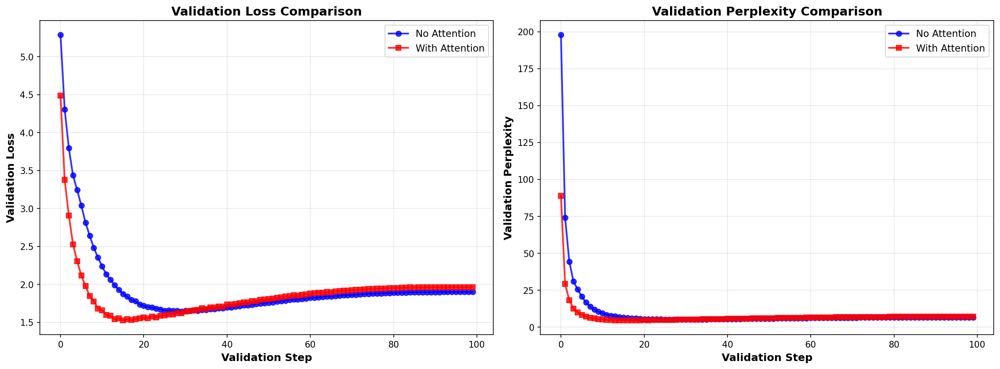

# German→English Translation: Attention vs. Non-Attention Models

> **Note:** The dataset is quite large for T4 GPU training. To achieve acceptable translation results efficiently, the original notebooks have been scriptized into production-ready scripts supporting Distributed Data Parallel (DDP) training. 
> 
> **This report is automatically generated** by [`generate_readme.py`](generate_readme.py) after each training run, with results populated from experiments.
> 
> **Translation Direction:** German (input) → English (output) - This allows for easy evaluation since English is more familiar.

---

## Table of Contents

1. [Links to Training Evidence](#1-links-to-training-evidence)
2. [Lab Assignment Results](#2-lab-assignment-results)
   - 2.1 [Model without Attention](#21-model-without-attention)
   - 2.2 [Model with Attention](#22-model-with-attention)
   - 2.3 [Validation Curves](#23-validation-curves)
   - 2.4 [Comparison and Analysis](#24-comparison-and-analysis)
3. [How to Run (For Reviewers)](#3-how-to-run-for-reviewers)
   - 3.1 [Evaluate Pre-trained Models](#31-evaluate-pre-trained-models-from-hugging-face-hub)
   - 3.2 [Full Training Pipeline](#32-full-training-pipeline)
   - 3.3 [Custom Training](#33-custom-training)
4. [Project Structure](#4-project-structure)
5. [Model Architecture](#5-model-architecture)
6. [Configuration](#6-configuration)
7. [Additional Information](#7-additional-information)

---

## 1. Links to Training Evidence

> <sub>**🔴 [AUTO-GENERATED]** Links below are automatically populated from training runs</sub>

This project includes realistic distributed training with experiment tracking:

**Repositories:** <sub>**🔴 [AUTO-GENERATED]**</sub>
- **GitHub:** https://github.com/tuandung222/Translate-EN-DE-Exercise
- **Model Hub:** https://huggingface.co/tuandunghcmut/Exercise-Translate-EN-DE-LLM-Course

**Experiment Tracking (Weights & Biases):** <sub>**🔴 [AUTO-GENERATED]**</sub>

- **Model without Attention:**
  - Dashboard: https://wandb.ai/Private_1/translation-de-en/runs/esqmeu9i?nw=nwuser
  - Workspace: https://wandb.ai/Private_1/translation-de-en/workspace?nw=nwuser

- **Model with Attention:**
  - Dashboard: https://wandb.ai/Private_1/translation-de-en/runs/jtpchjkd?nw=nwuser
  - Workspace: https://wandb.ai/Private_1/translation-de-en/workspace?nw=nwuser

- **Project Overview:** https://wandb.ai/Private_1/translation-de-en?nw=nwuser

> All wandb links include `?nw=nwuser` for public access without login.

**What's Tracked:**
- Training/validation loss curves
- Perplexity over time
- Learning rate schedule
- Test set evaluation metrics (accuracy, BLEU)
- Model architecture and hyperparameters
- Hardware utilization (GPU, memory)

---

## Lab Assignment Results

### 2.1 Model without Attention

**Architecture:** 4-layer GRU encoder-decoder, no attention mechanism

**Training:** 50 epochs, batch 1024, hidden 512, bfloat16 precision

**Results:** <sub>**🔴 [AUTO-GENERATED]**</sub>

| Metric | Score |
|--------|-------|
| Accuracy | 0.0701 |
| BLEU | 0.0063 |
| BERTScore (F1) | 0.6952 |
| BLEURT | 0.0999 |
| COMET | 0.3208 |
| Test Loss | 5.1840 |

---

### 2.2 Model with Attention

**Architecture:** 4-layer GRU encoder-decoder with Bahdanau attention

**Training:** 1 epochs, batch 1024, hidden 512, bfloat16 precision

**Results:** <sub>**🔴 [AUTO-GENERATED]**</sub>

| Metric | Score |
|--------|-------|
| Accuracy | 0.1574 |
| BLEU | 0.0237 |
| BERTScore (F1) | 0.7279 |
| BLEURT | 0.2792 |
| COMET | 0.3229 |
| Test Loss | 4.2613 |

---

### 2.3 Validation Curves

<sub>**🔴 [AUTO-GENERATED]** Training progress comparison showing both models:</sub>



*This chart compares validation loss and perplexity over training steps for both models, demonstrating convergence speed and final performance.*

---

### 2.4 Comparison and Analysis

**Quantitative Comparison:** <sub>**🔴 [AUTO-GENERATED]**</sub>

| Metric | No Attention | With Attention | Improvement |
|--------|--------------|----------------|-------------|
| Accuracy | 0.0701 | 0.1574 | +124.5% |
| BLEU | 0.0063 | 0.0237 | +276.2% |
| BERTScore (F1) | 0.6952 | 0.7279 | +4.7% |
| BLEURT | 0.0999 | 0.2792 | +179.5% |
| COMET | 0.3208 | 0.3229 | +0.7% |
| Test Loss | 5.1840 | 4.2613 | 17.8% reduction |

<sub>**🔴 [AUTO-GENERATED]** **Analysis:**</sub>

Attention mechanism performs better on both accuracy and BLEU score.

<sub>**🔴 [AUTO-GENERATED]** **Qualitative Examples:**</sub>

| Source (German) | Reference (English) | No Attention | With Attention |
|----------------|--------------------|--------------|--------------------|
| eine brille lasst dich viel kluger aussehen | wearing glasses makes you look more intellectual | tom is a | a lot of a lot of you |
| denkst du ich bin blod | do you think im stupid | i have to the | i dont want to you |
| tom hat keine ahnung wer marys grovater ist | tom has no idea who marys grandfather is | tom is a | tom is a good of his and mary |
| er lief schneller als sein bruder | he ran faster than his brother did | i dont you to the | he was a lot of his car |
| halt mal die hande still | keep your hands still | i dont to the | the is the of the door |
| ich bin beschamt uber ihr verhalten | i am ashamed of your conduct | i dont to the | i have to you want to you |
| ich bin so mude dass ich gleich ins bett gehe wenn ich nach hause komme | im so tired that im going to bed as soon as i get home | i have to the | i dont have to be a lot of the car |
| die neuen hauser haben eine einheitliche hohe | the new houses are of a uniform height | i have to the | the is a lot of the of the day |
| mein grovater gab mir ein geburtstagsgeschenk | my grandfather gave me a birthday present | i dont you to the | my is a lot of my car |
| ihre haare sind zu lang | your hair is too long | i dont to the | he is a lot of of the |
| er nimmt geschenke von schulern an | he accepts gifts from students | tom is a | he was a lot of the door |
| wer ist sonst noch gegangen heute | who else is gone today | i dont you to the | this is a lot of the car |

---

## 3. How to Run (For Reviewers)

### 3.1 Evaluate Pre-trained Models from Hugging Face Hub

Download and evaluate our trained models without training from scratch:

```bash
# Install dependencies
pip install -r requirements.txt

# Evaluate model with attention
python predict.py --from_hub --model_type attention --sentence "hello world"

# Evaluate model without attention
python predict.py --from_hub --model_type no_attention --sentence "ich bin gut"

# Test on random examples from test set
python predict.py --from_hub --model_type attention --num_examples 10
```

**Model Hub Structure:**
- `tuandunghcmut/Exercise-Translate-EN-DE-LLM-Course/no_attention/best_model.pth`
- `tuandunghcmut/Exercise-Translate-EN-DE-LLM-Course/attention/best_model.pth`

### 3.2 Full Training Pipeline

Train both models from scratch and reproduce all results:

```bash
# Install dependencies
pip install -r requirements.txt

# Run full automated pipeline (train, evaluate, upload, commit)
# Uses 4 GPUs by default (configurable via CUDA_VISIBLE_DEVICES)
./distributed_run_full_pipeline.sh 4 true
```

This will:
1. Train both models (no_attention and attention)
2. Evaluate on test set
3. Generate comparison reports and visualizations
4. Update this README with results
5. Push checkpoints to Hugging Face Hub
6. Commit and push to GitHub

### 3.3 Custom Training

```bash
# Single GPU training
python train.py --config config_attention.yaml --use_wandb

# Multi-GPU distributed training (8 GPUs)
CUDA_VISIBLE_DEVICES=0,1,2,3,4,5,6,7 torchrun --nproc_per_node=8 train.py \
    --config config_attention.yaml --use_wandb
```

---

## 4. Project Structure

```
translate-de-en/
├── Core Model & Data
│   ├── model.py                      # Model architectures (Encoder, Decoder, Attention)
│   ├── data_loader.py                # Data loading with HuggingFace datasets
│   └── utils.py                      # Unified utilities (metrics, sampling, distributed, etc.)
├── Training & Evaluation
│   ├── train.py                      # Main training loop with DDP and mixed precision
│   └── evaluation.py                 # Model evaluation functions
├── Inference & Analysis
│   ├── predict.py                    # Inference with nucleus sampling
│   ├── analysis.py                   # Compare models and generate plots
│   └── generate_readme.py            # Auto-generate this README
├── Configuration & Scripts
│   ├── config_no_attention.yaml      # Hyperparameters for model without attention
│   ├── config_attention.yaml         # Hyperparameters for model with attention
│   ├── distributed_run_full_pipeline.sh  # Main automated training pipeline
│   ├── push_to_hub.py                # Upload models to HuggingFace Hub
│   └── test_predict.sh               # Quick prediction test script
├── Dependencies & Configuration
│   ├── requirements.txt              # Python dependencies
│   └── pyproject.toml                # Black formatter configuration
├── Data & Outputs
│   ├── data/                         # Dataset directory (auto-downloaded)
│   ├── checkpoints_attention/        # Attention model checkpoints + vocab
│   ├── checkpoints_no_attention/     # No-attention model checkpoints + vocab
│   └── analysis_results/             # All analysis outputs and reports
│       ├── comparison_report_*.txt   # Detailed evaluation reports
│       ├── comparison_table.txt      # Side-by-side metrics comparison
│       ├── qualitative_comparison.txt # Translation examples comparison
│       ├── metrics.json              # JSON metrics for programmatic access
│       ├── validation_comparison.png # Validation curves plot
│       └── plots/                    # Additional visualization plots
├── Notebooks & Archive
│   ├── notebooks/                    # Original Jupyter notebooks
│   └── archive_docs/                 # Archived documentation files
└── Cache & Temp
    ├── dataset_cache/                # HuggingFace datasets cache
    ├── wandb/                        # Weights & Biases logs
    └── __pycache__/                  # Python bytecode cache
```

**Key Features:**
- **Clean Organization:** All reports in `analysis_results/`, no clutter in root
- **Unified Utilities:** All helper functions consolidated in `utils.py`
- **Separate Checkpoints:** Each model type has its own checkpoint directory
- **Automated Pipeline:** Single script runs training, evaluation, and documentation

---

## 5. Model Architecture

<sub>**🔴 [AUTO-GENERATED]** Architecture specs populated from config files.</sub>

### Encoder-Decoder Architecture

This project uses **Residual Stacked GRU** with **Layer Normalization** to train deep networks effectively.

**Implementation Classes** (see `model.py`):
- `ResidualStackedGRUEncoder` - Encoder with residual connections and layer normalization
- `ResidualStackedGRUDecoder` - Decoder without attention
- `ResidualStackedGRUAttnDecoder` - Decoder with Bahdanau attention mechanism

**Key Features:**
- **Residual Connections:** Enable gradient flow through deep networks (4-8 layers)
- **Layer Normalization:** Stabilizes training and improves convergence
- **Xavier Initialization:** Ensures proper gradient flow from the start

### Model Configuration

**Encoder (Shared):**
- Type: Residual Stacked GRU
- Layers: 4
- Hidden Size: 512
- Dropout: 0.1

**Decoder (No Attention):**
- Type: Residual Stacked GRU
- Layers: 4
- Hidden Size: 512
- Dropout: 0.1

**Decoder (With Attention):**
- Type: Residual Stacked GRU + Bahdanau Attention
- Layers: 4
- Hidden Size: 512
- Attention Dim: 256
- Dropout: 0.1

### Training Configuration
- **Precision:** bfloat16
- **Optimizer:** AdamW8bit (bitsandbytes)
- **Scheduler:** CosineAnnealingLR
- **Gradient Clipping:** Max norm = 1.25
- **Distributed:** PyTorch DDP
- **Teacher Forcing:** 100% during training

### Evaluation Strategy

**Validation (during training):**
- Uses validation loss and perplexity
- Teacher forcing for fast computation
- Evaluated every 1/2 epoch for monitoring convergence

**Test Set (final evaluation):**
- Auto-regressive generation with nucleus sampling for qualitative results
- Nucleus sampling parameters (optimized for translation quality):
  - `top_k`: 20 (consider top-20 tokens)
  - `top_p`: 0.6 (nucleus threshold)
  - `temperature`: 0.3 (low temperature for more deterministic, accurate translations)
  - `repetition_penalty`: 1.05 (discourage repetition)
  - `max_length`: 64 (maximum generation length)
- Limited to 512 instances for reasonable computation time
- Evaluation metrics:
  - **Accuracy**: Token-level matching with reference
  - **BLEU**: Standard n-gram overlap metric
  - **BERTScore**: Semantic similarity using DistilBERT embeddings
  - **BLEURT**: Learned evaluation metric (BLEURT-20-D3)
  - **COMET**: Translation quality estimation (wmt22-cometkiwi-da)
- Qualitative translation examples for human assessment


---

## 6. Configuration

Models are configured via YAML files. Edit these files to change hyperparameters:

### `config_no_attention.yaml` / `config_attention.yaml`

<sub>**🔴 [AUTO-GENERATED]** Configuration values below are automatically loaded from YAML files.</sub>

```yaml
model_type: attention              # 'attention' or 'no_attention'
hidden_size: 512                   # Hidden dimension
num_layers: 4                     # Number of GRU layers
dropout: 0.1                       # Dropout probability
max_length: 64                    # Max sequence length

n_epochs: 1                        # Training epochs
batch_size: 1024                    # Batch size (per GPU)
learning_rate: 0.0002             # Initial learning rate
max_grad_norm: 1.25                  # Gradient clipping

data_source: local                 # 'local' or 'tatoeba'
num_workers: 16                   # DataLoader workers

save_dir: checkpoints_attention    # Checkpoint directory
wandb_project: translation-de-en   # Wandb project name
```


**Key Parameters:**
- `num_layers`: Increase for more capacity (8 → 16 layers)
- `batch_size`: Larger batches for faster training (GPU memory permitting)
- `n_epochs`: More epochs for lower loss (1 → 50 for production)
- `hidden_size`: Model capacity (256 → 768 → 1024)

---

## 7. Additional Information

### Automatic Features

This project includes full automation:

**Auto-Training Pipeline:**
- Multi-GPU distributed training (DDP)
- Automatic checkpoint saving (best validation loss)
- Vocabulary persistence (pkl files)
- Validation translation sampling (track improvement)

**Auto-Evaluation:**
- Test set evaluation after training
- BLEU score, accuracy, perplexity calculation
- Qualitative translation examples
- Comparison table generation with plots

**Auto-Documentation:**
- This README regenerates after each training run
- Results automatically populated from experiment reports
- Qualitative examples dynamically inserted
- Wandb experiment links auto-detected

**Auto-Upload:**
- Models pushed to Hugging Face Hub: `tuandunghcmut/Exercise-Translate-EN-DE-LLM-Course`
- Model cards generated with training details
- Vocabulary files uploaded for inference

**Auto-Git:**
- Results committed to repository
- README and reports pushed to GitHub
- Training metrics in commit message

### Links

- **GitHub:** https://github.com/tuandung222/Translate-EN-DE-Exercise
- **Model Hub:** https://huggingface.co/tuandunghcmut/Exercise-Translate-EN-DE-LLM-Course
- **Dataset:** German-English translation pairs (~150K pairs)
- **Wandb Project:** https://wandb.ai/TuanDung111/translation-de-en

### Code Quality

- **Formatting:** Code is formatted with `black` (line length = 100)
- **Logging:** Minimal, meaningful logs only (not verbose)
- **Documentation:** This README is auto-generated after each training run
- **Results:** Dynamic metrics populated from actual training experiments
- **Testing:** All division operations protected against zero values
